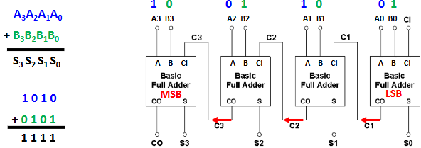
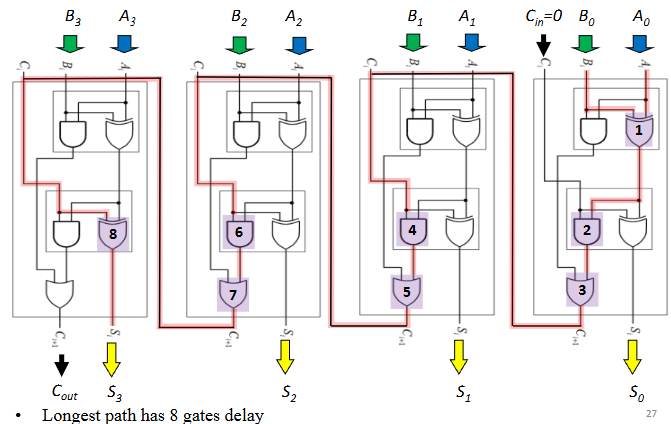
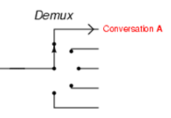
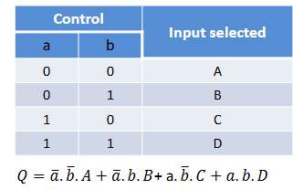
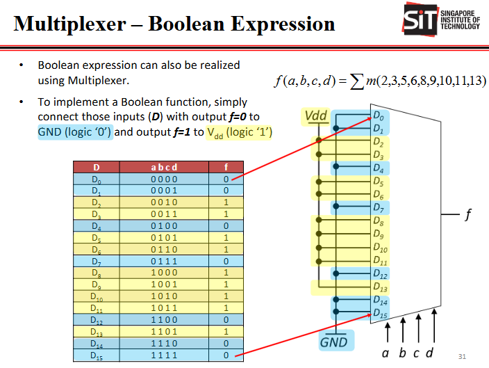
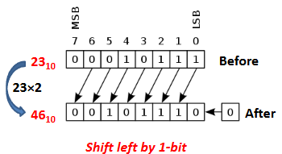
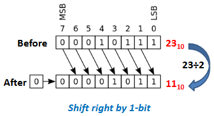
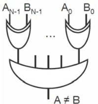

# Lecture 1: Digital Age

## Computers through the ages

- 1964: ENIAC, $63m^2$, 30 tons
- 1950: EDVAC, $45m^2$, 7850kg
- 1959-1965: 2nd Gen Mainframe Computer (IBM 7094), Transistor
- 1965-1971: 3rd Gen Mini Computer, Integrated Circuit
- 1971- now: 4th Gen Micro Computers, Very Large Scaale Integration

## Define Computer

- A programable machine designed to automatically carry out a seequence of arithmatic or logical operations

## Types of Computers

- Supercomputer
- Personal Computer (laptop, tablet, smartphone)
- Embedded Computer (Smartwatch, TV control box)

## Timing

- Majority of  digital circuits aree sychronus
- means have clock signal (heart bit of system hehehaha)

## Binary logic

- Positive logic: High = 1, Low = 0
- Negative logic: High = 0, Low = 1
- computer has 4 limits, making 3 bands: V(L min), V(L max), V(H min), V(H max)
- any voltage between V(L max) and V(H min) is part of unacceptable value
- 3 bands are High Unacceptable and Low

## Info Size

- Bit
- Byte, 8 Bits
- Word, 2 Bytes, 8 Bits
- Kilo, 1024
- Mega, 1024x1024 = 1048576
- Giga, 1024x1024x1024 = 1073741824
- Tera, 1024x Giga

Note: When refering to info size, kilo is 1024. When refering to speeds e.g. sample rate, kilo is 1000

## Bit importance

- MSB = Most significant bit i.e. bit representing largest value
- LSB = Least significant bit i.e. the ones bit

|  0|0|0|0|0|0|0|0  | 
|:-:|-|-|-|-|-|-|:-:| 
|  ^|-|-|-|-|-|-|^  |  
|MSB|-|-|-|-|-|-|LSB|

## Analogue to Digial Signal

Sampling vs quantization
- Sampling is by time(x-axis)
- Quantization is by value(y-axis)
- Sampling is cutting up the signal into discrete time blocks 
- quantization is cuttin up the signal amplitude into equal steps

Nyquist Rate
- Sampling frequency must be more than 2x max frequency of input.
- $f(sample) > 2 * f(input)$
- $f(sample)$ **cannot be equals to** $2 * f(input)$.
- If unlucky and $f(sample) = 2 * f(input)$, possible to only sample the 0 value of the wave

> Sampling rates
>> 1s = 1Hz  
>> 1ms = 0.0001s = 1KHz  
>> 1us = 0.0001ms = 0.0000001s = 1MHz  
>> 1ns = 0.0001us = 0.0000001ms = 0.0000000001s = 1Ghz

Quantiztion steps should also be reasonably small.  
Example, input voltage 0.3, but quantize voltage is 1 and -1 then will have error.  
even for 1, 0.33, -0.33, -1, value of 0.35 will be rounded wrongly

Quantization will determine how many bits each channel needs per sample.  
Usually 8, 10, 12, 16, 24

# Lecture 2: Number systems

## Positional Number systems

Decimal binary hexadecimal are positional number systems
the position of each digit determines and represents a diffrent power of 10, 2 or 8  
You maybe able to determin which number system is being used based on which digits are present.
e.g.
- 90FE is cnfm hex
- 9081 maybe decimal or hex
- 1011 maybe decimal, hex or binary  

you denote the system y using subscript $_2$ or $_{16}$  
hex sometimes denoted with a 0x or H` as prefix

apparently you can write binary decimal as well  
$1011.11 = 1*2^3 + 1*2^1 + 1*2^0 + 1*2^{-1} + 1*2^{-2}$

## Signing a number

Sign-magnitude representation
- just means num is signed. does not tell you HOW it's signed

n-bit sign-magnitude binary can rep values from $-(2^{n-1}-1)$ to $+(2^{n-1}-1)$  
e.g. 8 bit binary therefore can store up to 7 bit of value  
i.e. 127 +ve and -ve  
also results in a +ve 0 and -ve 0 representation

1's complement is the WEIRD way to sign and is not used in computers  
- the compleement of a binary digit is the invers of all the digits.  
- i.e
- 010 for 2
- then 101 is -2

still uses MSB to rep +ve and -ve numbers, 0 = +ve, 1 = -ve  
1's complement more easy to use in circuits as you just NOT gate each binary digit.  
to derive -ve number for 1's complement, find +ve value first, then invert all bits

2's complement is the default way to sign
- take the +ve value and invert bit like 1s complement
- add 1
- finish

changes value range to -2^n-1^ to +(2^n-1^-1)  
removes -0 representation

## addition, sub traction and overflow

+ve + +ve = +ve (possible over flow)  
-ve + -ve = -ve (possible over flow)  
+ve + -ve = +ve or -ve (NO over flow)

Assume next 2 cases are 4 bit only system

$$1111_2 + 1111_2 = [1]1110_2$$

^ in this case you run out of bits.  
so you change carry flag to 1  
but since MSB is still negative, logic is correct so overflow flag is still 0
_____________

$$1001_2 + 1010_2 = [1]0011_2$$

^ in this case also run out of bits.  
so you change carry flag to 1.  
since MSB is 0 but both initial values MSB was 1, logic has failed as output is positive.  
Thus, overflow flag must be changed to 1
______________

|       |$^2->^1$|$^2$|   |   |
|:-----:|:------:|----| - | - |
|~~[1]~~|    0   | 0  | 1 | 1 |
|   -   |    0   | 1  | 1 | 0 |
|       |    1   | 1  | 0 | 1 |

^ borrow imiginary bit, 3-6 = -3 so logic ok, no overflow  

|       |   |     | $^2$|$^2$|
|:-----:|---|-----|  -  | -  |
|       | 0 |~~1~~|~~1~~| 0  |
|   -   | 0 |  0  |  1  | 1  |
|       | 0 |  0  |  1  | 1  |

^ 6-3 = 3 so logic ok, no overflow

|       |     |$^2->^1$| $^2$|$^2$|
|:-----:|:---:|:------:|  -  | -  |
|       |~~1~~|    0   |~~1~~| 0  |
|   -   |  0  |    0   |  1  | 1  |
|       |  0  |    1   |  1  | 1  |
  
^^ -6-3 = 7, logic fail, overflow

if number is positive, can extend leading bits with 0  
e.g. 0011 = 0000 0011  
if number is negative, can extend leading bits with 1  
e.g. 1001 = 1111 1001

## IEEE-754 Mantissa

$$(-1)^{sign} * 1.mantissa *2^{(exponent-127)}$$

$25.75$ to IEEE-754  
split decimal into whole num and fractional  
whole: 25, fractional: 0.75  
Find binary equivalent of fractional part
$$ 0.75*2 = 1.5 \ \ \ -> (1)$$
$$ 0.5*2 = 1.0 \ \ \ -> (1)$$  
binary equivalent: $11001.11_2$  
move binary point to the **left** until you get $1.matissa$
$$11001.11 -> 1.100111$$  
Note: Moved to left (4) times, this will be the Exponent  

- Sign: is +ve so sign = 0  
- Mantissa = 1.[100111] from 1.100111  
- Exponent : 4 = exp-127 => 131 = 10000011  

NOTE: Exponent is unsigned.

_______

$.75$ to IEEE-754  
split decimal into whole num and fractional  
whole: 0, fractional: 0.75  
Find binary equivalent of fractional part
$$ 0.75*2 = 1.5\ \ \ -> (1)$$
$$ 0.5*2 = 1.0\ \ \ -> (1)$$  
binary equivalent: $0.11_2$  
move binary point to the **right** until you get $1.mantissa$  
$0.11 -> 1.1$  
Note Moved to right (1) times, This will be the exponent 
- Sign: is +ve so sign = 0  
- Mantissa = 1.[1] from 1.1  
- Exponent : -1 = exp+127 => 126 = 10000011  

NOTE: Exponent is unsigned.  
Exponent is how many times you shift the binary point to the left,  
in this case moved right so is -1 and change exponent bias 127 to +

## Gray code

only one bit change at a time  
00 -> 01 -> 11 -> 10  
cannot go from 01 -> 10

## Serial vs Parallel

Serial: transfer one bit at a time  
is slow  
use case: longer range transmission (USB, TCP/IP, RS232, SATA)  

Parallel: transfer multiple bits at once  
is fast  
Subhect to synchronisation issues
use case: short range communication (ATAPI, internal buses)

## Parity

used to identify errors by adding 1 bit to the data  
Parity bit is attached to a group of bits to make the total number of 1s in a group always even (Even parity) or always odd (Odd parity).  

Parity type is agreed between users before sending data
if error detected, parity cannot recover the data.
Parity can be added as LSB or MSB, depend on user agreement

Even: 1011 011[1] -> sum of 1's= 6  
Odd : 1011 011[0] -> sum of 1's= 5

Other error detection: Cyclic redundancy check (CRC), Hamming code

# Topic 3: Combinatorial Circuits

Generally: Ture = 1, False = 0  
Logic circuits types:
- Combinatorial  
- - Output depends only on current inputs
- Sequential
- - Output depends not only on current inputs but past sequence of inputs

ALU is Combinatorial circuit, doesnt use clock

Control Unit and Registers are sequential circuits, uses clock

Basic logic ops:
- AND
- OR
- NOT
 
## AND

$Z_{AND} = A . B = A ∧ B$

0 AND 0 = 0
0 AND 1 = 0
1 AND 0 = 0
1 AND 1 = 1

## NAND

NOT AND

$Z_{NAND} = \bar{A . B} =$
0 NAND 0 = 1
0 NAND 1 = 1
1 NAND 0 = 1
1 NAND 1 = 0

## OR

$Z_{OR} = A + B = A ∨ B$

0 OR 0 = 0
0 OR 1 = 1
1 OR 0 = 1
1 OR 1 = 1

## NOR

NOT OR

$Z_{NOR} = \bar{A + B} =$
0 NOR 0 = 1
0 NOR 1 = 0
1 NOR 0 = 0
1 NOR 1 = 0

## Boolean algebra Characteristics:

Will be in quick reference sheet

## Propogation delay

takes time for electricity to travel through circuit, time taken ($\Delta t$)

## Canonical form

is 

## Sum of Product
basically "sum" (basically or) all options in truth table that output 1 (i.e. maxterm) 
e.g.
ABC and A\`BC give 1, then ABC OR A\`BC = $ABC + \`ABC$

## Product of Sum
basically "multiply" (basically and) all options in truth table that output 0 (i.e. minterm) 
e.g.
ABC and A\`BC give 0, then ABC AND A\`BC = $ABC . \`ABC$

## Ripple (carry) adder

made of half adder and full adder  
2x half adder = full adder
  
  
  

chaining multiple full adders together can add N-bit numbers  
each carry bit "ripples" to next full adder
slow for many bits
- Since the carry may need to be propagated along the longest path from the LSB to
the MSB, the delay is proportional to the bit length to be added.

  

## MUX and DEMUX

MUX is choose 1 of many and send through one output  

DEMUX is choose 1 of many output using an isolated select input and send data from single input

N-Multiplexer  
has $2^n$ inputs  
has n select(address) inputs
has 1 output

high level multiplexer can be constructed using lower level multiplexer

for multiplexer gate, sel = 0 is choose top, sel = 1 is choose bottom

multiplexer equation:
use control inputs and which input selected  
for which input selected, assume val is 1
e.g.  

multiplexer boolean:  

## Logic Shift

SL = Shift left, multiply by 2
SR = Shift Right, divide by 2

does not preserve sign bit  
once shifted, vacant positions filled usually by 0

 

## Comparator

used to check if bit is =, > or <

n-bit comparator:  
2 ways to do:  
- binary subtraction: outputs: >= or <  
- XOR each bit or inputs then OR all XOR ouput: outputs: =, !=  

 

if combine both circuit, n-bit comparator done
|Subtraction|XOR|result|
|:---------:|:-:|:----:|
|     0     | 0 |  x   |
|     0     | 1 |  <   |
|     1     | 0 |  =   |
|     1     | 1 |  >   |

# tut1

2's complement trick
find last instance of 1, all 0 right of last instance of 1 remain as 0, flip all bits left of last instance 1 except MSB

e.g.:
|-|-|-|-|-|-|-|-|
|:-:|:-:|:-:|:-:|:-:|:-:|:-:|:-:|
|1|0|1|0|0|1|0|0|
|[1]|0|1|0|0|[1]|0|0|
|[1]|1|0|1|1|[1]|0|0| -- end

q1a

$\frac{2v}{8}$ step cus $2^3$

0, 0.5, 1.5, 1.75, 1.75

never hits max 2v.  
because need to keep 000 for 0V, no choice have to give up 2v  
considered boundary case

error
0.001, 0.011, 0.068, 0.053, 0.146

standard choice: $\frac{Vmax}{2^n}$  
if req to include Vmax: $\frac{Vmax}{(2^n -1)}$  
other possibility: 000 = midpoint of step between (0 and 0.25)

q1b

sum all absolute / num samples

max error is $\frac{(v/2^n)}{2}$ as max error is when voltage is exactly in middle of diff between step values

q1c

$\frac{(Vmax/2^10)}{2} = \frac{(2/2^10)}{2} = 0.97mV$

q1d  
increase ADC bits increase resolution but also increase overall file size

q2a  
120(dec) = 1000 0000  
NOTE need to delcare somehow that is a positive number. since by default is 2's complement  
e.g. 0 1000 0000 or 1000 000 (unsigned)

q2b  
by default is 2's complement  
neg representation 1010 1011 0001 0010 1110 1111 (bin)  
2's complement pos num: 1101 0100 1110 1101 0001 0001 (bin)

-5 565 713 (dec)

q2c  
164 (unsigned), -36 (sign magnitude), -91(1's complement), -92(2's complement)  (all dec)  
need declare which is which

q2d  
11 1011(sign-magnitude), 10 0100(1's complement), 10 0101(2's complement)  (all bin)  
need declare which is which

q2e  
9.375 

q2f  
0001 0100 0100.1111 (unsigned bin)

q2g  
0101 0011 1001. 0101 0111 (BCD)

q2h    
0 1000 0101 000 0000 0100 0000 0000 0000 (bin floating point)  
word ver: 42804000 (hex)

q2i  
C46A 0840(hex) = 1100 0100 0110 1010 0000 1000 0100 0000 (bin)  
[1][100 0100 0][110 1010 0000 1000 0100 0000]

[100 0100 0] = 136 raw value  
exponent bias: -127 = 9  
mantissa = 1.[110 1010 0000 1000 0100 0000]  
shift bits **right** (since is decoding) by exponent times  
1.110 1010 0000 1000 0100 0000 -> 1110 1010 00.00 1000 0100 0000  
936.12890625 (dec)  
rmbr add neg sign because sign bit is 1  
-936.12890625 (dec)

q3a  
89  = 0101 1001

27  = 0001 1011  
-27 = 1110 0100 +1 = 1110 0101

89-(27)
| | |     |$^2 ->^1$|$^2$|$^2$  |$^2 ->^1$|$^2$| |
|-|-|-----|:-------:|-----|-----|:-------:|----|-|
| |0|~~1~~|    0    |~~1~~|~~1~~|    0    |  0 |1|
|-|0|  0  |    0    |  1  |  1  |    0    |  1 |1|
| |0|  0  |    1    |  1  |  1  |    1    |  1 |0|
    
^^^ result ok

89+(-27)

|$^1$|$^1$| | | | | |$^1$| |
|----|----|-|-|-|-|-|----|-|
|    | 0  |1|0|1|1|0| 0  |1|
|  + | 1  |1|1|0|0|1| 0  |1|
| [1]| 0  |0|1|1|1|1| 1  |0|

^^^ incorrect as carry not shown

q3b
44 = 0010 1100  
-44 = 1101 0011 +1 = 1101 0100  
99 = 0110 0011  
-99 = 1001 1100 +1 = 1001 1101

-44 - (+99)
| |     |$^2$ |$^2$| | |     |$^2 ->^1$|$^2$|
|-|-----|-----|----|-|-|-----|:-------:|----|
| |~~1~~|~~1~~|  0 |1|0|~~1~~|    0    |  0 |
|-|  0  |  1  |  1 |0|0|  0  |    1    |  1 |
| |  0  |  1  |  1 |1|0|  0  |    0    |  1 |

^^^incorrect as is positive, overflow

-44 + (-99)
|$^1$| | |$^1$|$^1$| $^1$| | | |
|----|-|-|----|----|-----|-|-|-|
|    |1|1|  0 |  1 |  0  |1|0|0|
|  + |1|0|  0 |  1 |  1  |1|0|1|
| [1]|0|1|  1 |  1 |  0  |0|0|1|

^^^added extra 1, carry and overflow

q4
decimal x: 86, 126, 6, 0, -128
decimal y: 86, 3, -6, -8, -1
binary z: 1010 1100, 1000 0001, 0000 0000, 1111 1000, 0111 1111
decimal z: -86,-127, 0, -8, 127
overflow: yes,yes,no,no,yes